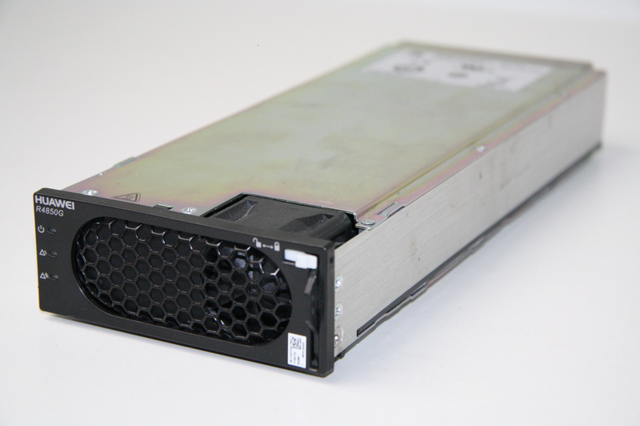
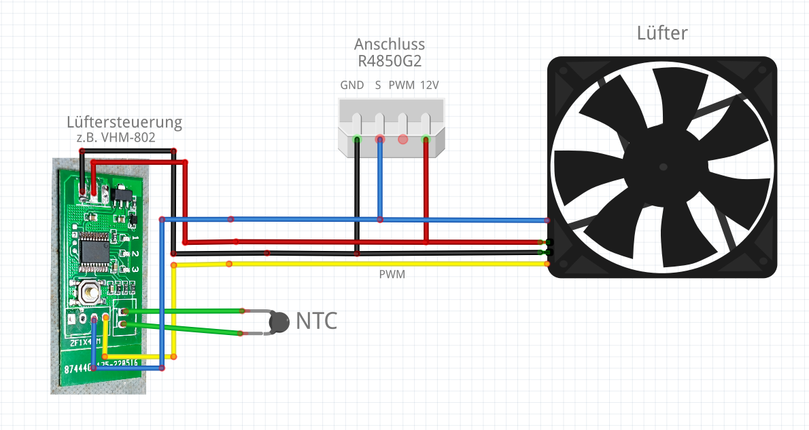
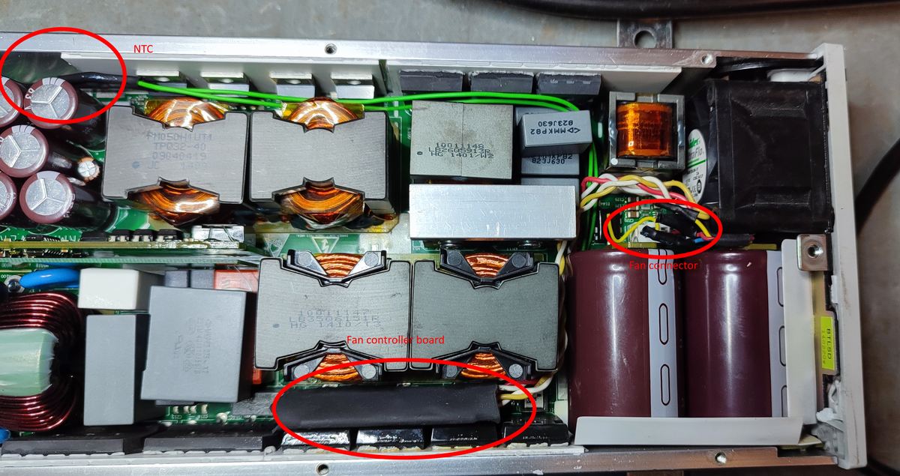
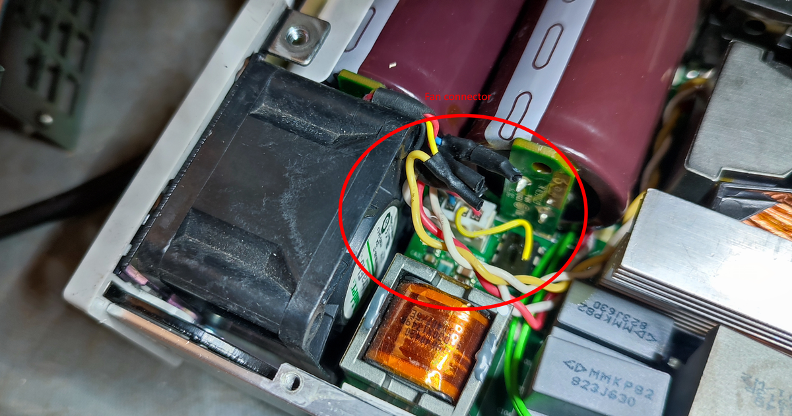
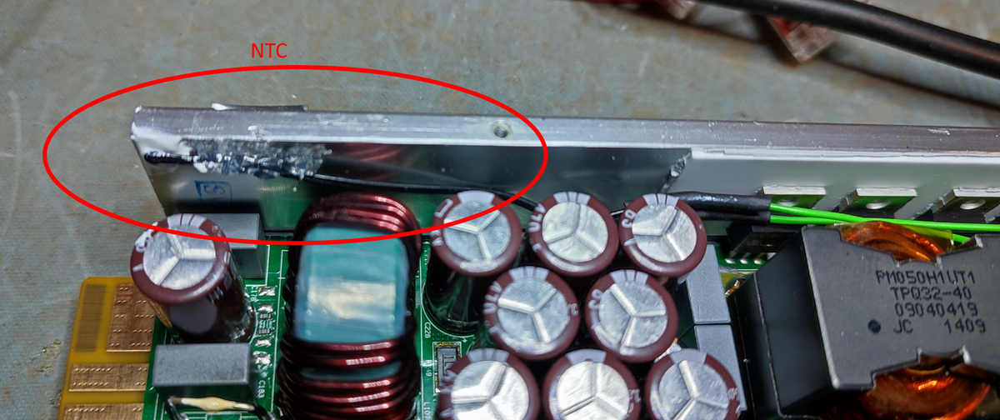
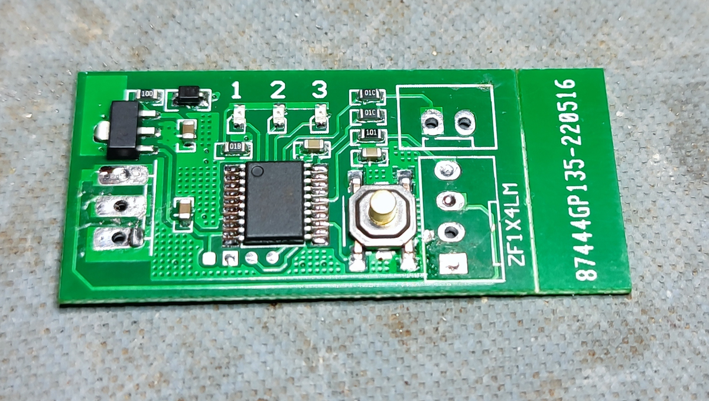
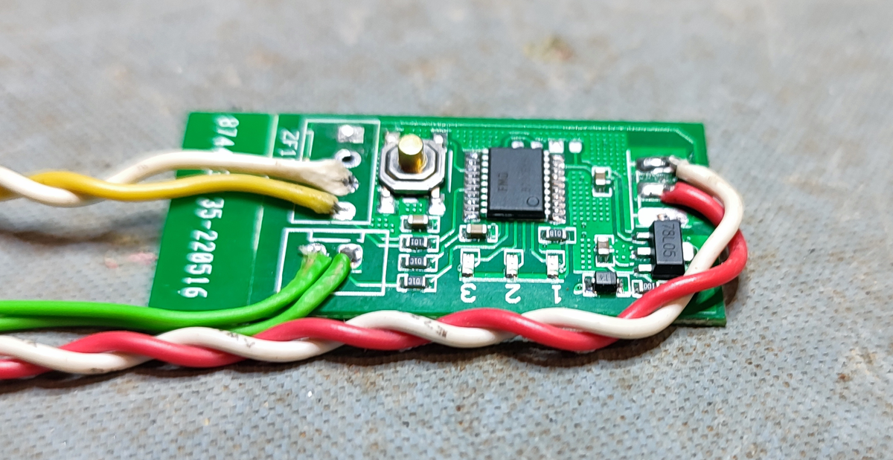
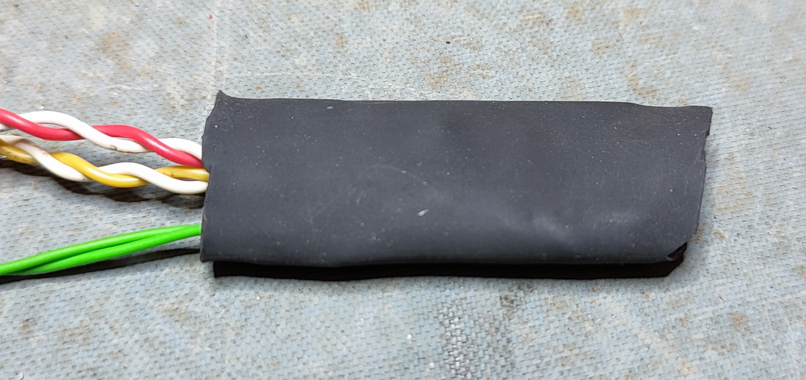

# DIY Huawei PSU R4850G2 fan control

## Warning:

All work on 230V voltage can be life threatening and should only be performed by trained professionals.   
This project is for research purposes only and should not be used in a production environment.

## About

This project wants to show how to replace the fan controller of the Huawei R4850G2 with a better one.

## Hardware

- Huawei PSU R4850G2 (from Ebxy or AliEx)
- DC 12V PWM Fan Temperature Controller 4-Wire Speed Governor Board (e.g. VHM-802)
- Some wires / Insulating material

## Info

If you found this page, you are already well informed about the possibilities of the R4850G2, I think.
The main use in the DIY sector is probably in the application for charging 48V DIY batteries / power storage.
  
The Huawei R4850G2 PSUs are probably some of the most impressive devices I've seen in recent years, from the electrical performance to the perfect mechanical build.

The biggest disadvantage in my opinion is the built-in fan control. For example, it does not regulate to the highest speed under full load, but it does when the voltage at the output drops below a certain value. That might make sense in the original application, but not when it is supposed to do its job as a normal power supply.

The solution is fortunately quite simple, there are 12V fan controllers for little money, which even still find space in the housing of the R4850G2.
In the following I explain how I did the conversion.

## Realization

### Modify the new fan controller board
- Configure the control board with the pushbutton (Normal mode "LED2 on") and set the desired temperature settings.
- Remove the connectors from the fan controller board
- Solder new cables long enough to reach the fan and the NTC well.
- Isolate the fan control board completely, e.g. with heat shrink tubing.

### Modify R4850G2
- !Check for absence of voltage 230V!
- Remove top cover R4850G2
- Remove fan connector from board
- Cut the cable of the fan in the middle between the connector and the fan
- Connect the wires of the R4850G2 fan connector, the fan and the new control board as shown in the diagram
- Place the NTC resistor in the most suitable position possible (I fixed it with hot glue)

## Wiring diagram

## Images

The controller board placed inside the R4850G2

The modified fan connector

New NTC position

Removed connectors/cable

Added cable

Isolated board

